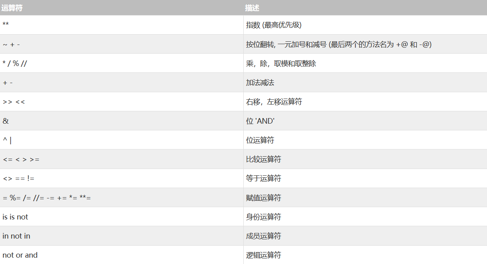

# Python强化训练

Python现在用途越来越广泛，尽管本人早已入门Python，但仍未充分体会到Python的奥秘，故建此项目以强化Python编程。

而由于已经有了一定的Python基础，所以可能不需要像其他语言一样进行完整的入门训练，只需稍加复习即可。

## Python相关版本
| 软件 | 版本 |
|:---:|:---:|
| Anaconda | 4.8.2 |
| Python(Anaconda附带) | 3.7.6 |
| pip(Python附带) | 20.0.2 |

## 札记
1.索引总结(0为起点)
> a[2:8:3] 从索引2到索引8步长为3 
> a[2] 第3个元素 
> a[-2] 倒数第4个元素 
> a[3:5] 从索引3到索引5步长为1 
> a[3:-5] 从索引3到倒数第5个元素步长为1 
> a[2:] 从索引2开始直到结束 
> a[-2:] 从倒数第2个元素开始直到结束 
> a[:3] 从开始到索引为3结束 
> a[:-2] 从开始到倒数第2个元素结束

再归纳：
- `[:]`
- `[:stop]`
- `[start:]`
- `[start:stop]`
- `[::step]`
- `[start::step]`
- `[:stop:step]`
- `[start:stop:step]`

2.判断引用使用`is`和`is not`

3.关于布尔值
> 0==False 
> 1==True 

4.获取当前时间`time.gmtime()`

5.逻辑联结词`and`、`or`、`not`

6.理论上不用分号，多语句可使用逗号或分号分隔：
- 使用逗号返回元组
- 使用分号返回第一个返回值

7.算术运算符注意`//`和`/`

8.

9.pass空语句还是很有用的

10.type()可查看变量类型
