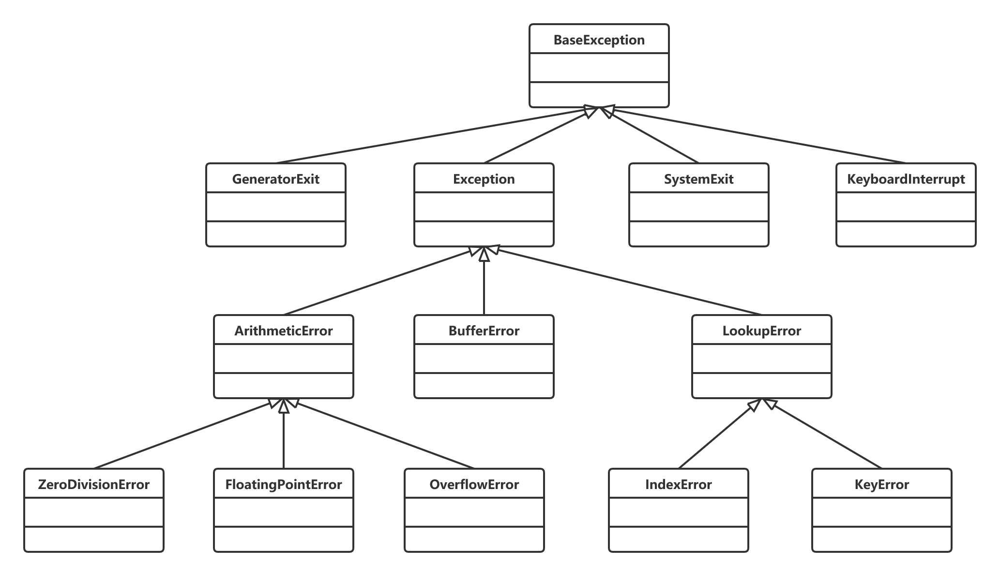

# 异常处理



1.Python与异常处理有关的关键字有5个：`try`、`except`、`else`、`finally`、`raise`。

2.当没有出现异常时，可为其添加一个else语句块。

3.尽量避免在finally块中使用return语句或者raise语句等导致方法中断的语句，否则可能出现一些奇怪的情况。

4.异常处理也支持嵌套，但是通常无须超过两层嵌套。

5.自定义异常类示例：<br/>
    ```python
    class MyException(Exception):
        pass
    ```

6.raise语句处于except块中时，会自动引发当前上下文激活的异常；否则，通常引发RuntimeError异常。

7.成功的异常处理应该达到以下四个目标：
- 使程序代码的混乱最小化
- 捕获并保留诊断信息
- 通知合适的人员
- 采用合适的方式结束异常活动

8.过度异常使用的主要表现：
- 把异常和普通错误混淆在一起，不再编写任何错误处理代码，而是简单地引发异常来代替所有的错误处理。
- 使用异常处理来代替流程控制。

9.对异常的处理方法：
- 对异常进行合适的修复和处理
- 重新引发新的异常
- 在合适的层处理异常

10.try语句可以捕获异常，当抛出异常时，处理方法示例如下：
- 忽略异常
- 记录异常
- 从异常中恢复
- 静默异常
- 重写异常
- 链接异常
