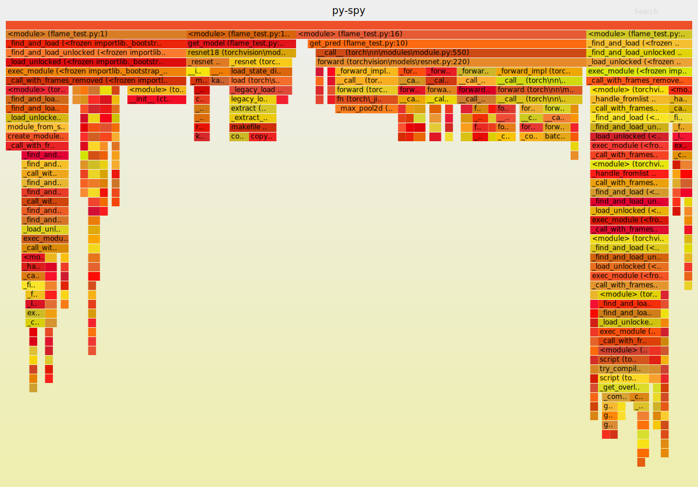

# Py-Spy说明

切到对应目录下，CMD输入命令：
```shell script
py-spy record --output flame_img.svg -- python flame_test.py
```

如果使用PyCharm的Terminal，报错如下：
```text
Error: 仅完成部分的 ReadProcessMemory 或 WriteProcessMemory 请求。 (os error 299)
```

CMD得到的图：

